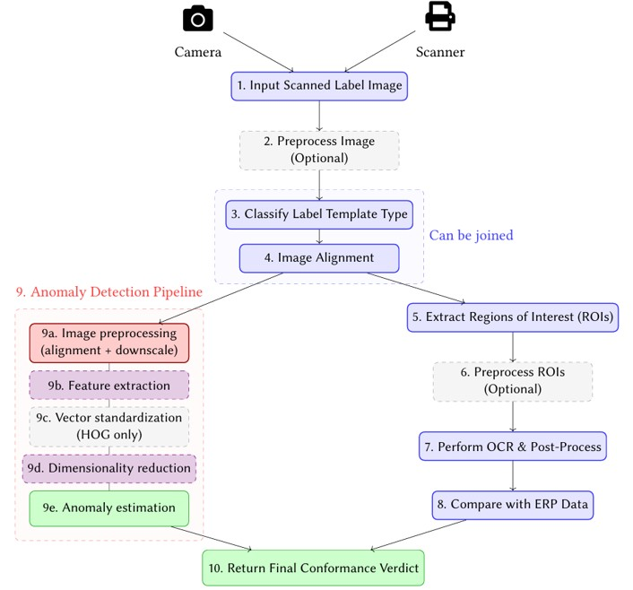
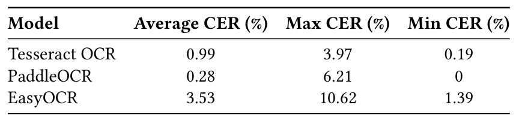
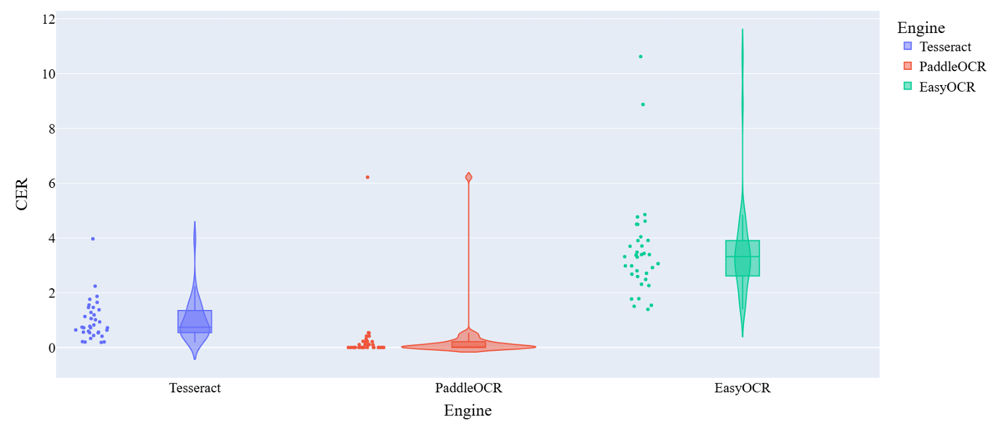
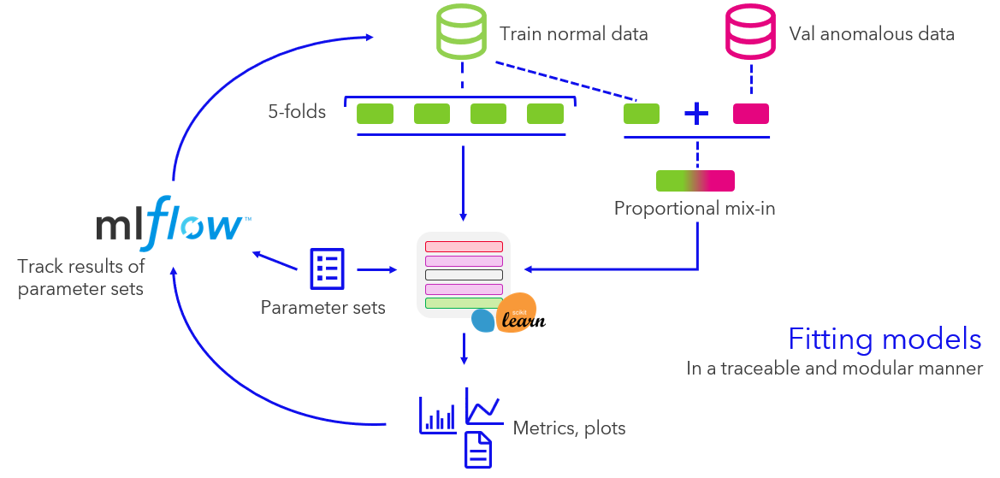
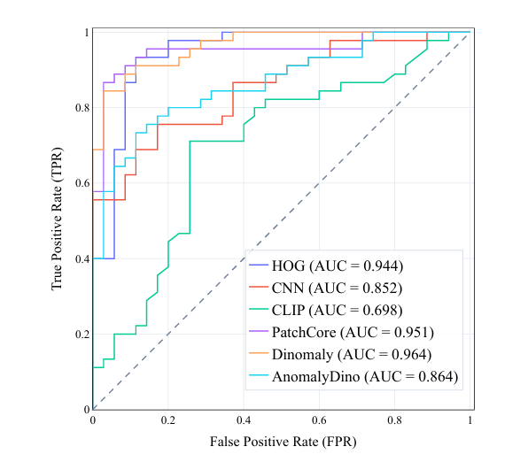
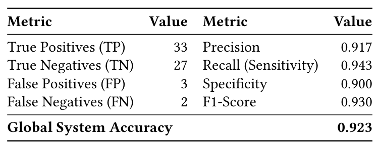
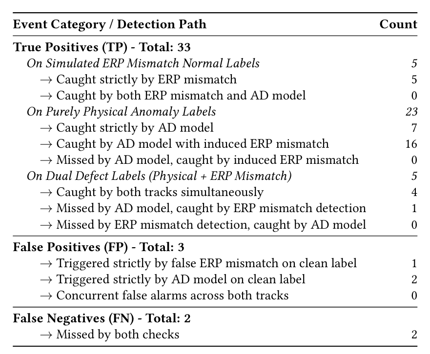
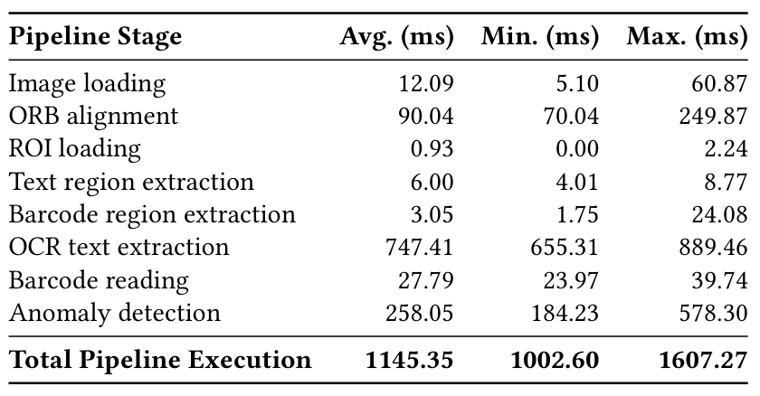

# AI-Driven Label Misprint Detection: Computer Vision System for Medical Device Label Quality Control

### Bachelor thesis implementation

<div align="center">


</div>

System designed for off-line (no conveyor belt) label inspection with high volumes (180 labels analyzed in less than 5 minutes) with a focus on minimizing the manual labor.

## OCR and Barcode Detection
3 candidates for OCR model: TesseractOCR, EasyOCR, PaddleOCR. Tesseract turned out to be a better fit due to better accuracy/inference time trade-off.
<div align="center">

</div>
<div align="center">

</div>

Barcode detection is performed via ZXING-CPP library. It achieved a barcode reading accuracy of 99.71%  with 20 ms inference time on average per 10 barcodes.


## Anomaly detection
Multiple model configurations with different training paradigms (e.g. zero/few-shot, unsupervised anomaly detection, self-supervised anomaly detection) and model architectures were considered. Evaluation was performed in a training loop with result tracking via MLFlow.
<div align="center">

</div>

Dinomaly and Patchcore turned out to be the most promising candidates.
<div align="center">

</div>

## E2E Metrics
Overall, the system achieved the global accuracy of 0.923, while maintaining the inference time required.
<div align="center">

</div>
<div align="center">


</div>

## Repository structure

This repository contains multiple utility classes to process labels including:
- Image processing
- OCR via Tesseract OCR, EasyOCR and PaddleOCR
- Visualization
- Storing, creating and processing ROIs
- Anomaly detection
- Metric calculation, etc.

To process printed label information, scan PDFs are converted to images. 

 

## Setup notes:
- Install Tesseract OCR (recommend the UB Mannheim build). Ensure you know the full path to `tesseract.exe`, for example `C:\Program Files\Tesseract-OCR\tesseract.exe`.
- Install Poppler for Windows and note the folder that contains `pdftoppm.exe` (e.g. `C:\poppler-23.05.0\Library\bin`).
- To enable position independent and multi-symbol Data Matrix detection, the library needs to be compiled with a c++20 compiler. Link: https://pypi.org/project/zxing-cpp/
- Create a .env file to include:
```
POPPLER_PATH = "PATH_TO_POPPLER"
TESSERACT_PATH = "PATH_TO_TESSERACT"
```

Install Python dependencies:

```powershell
python -m pip install -r requirements.txt
```

